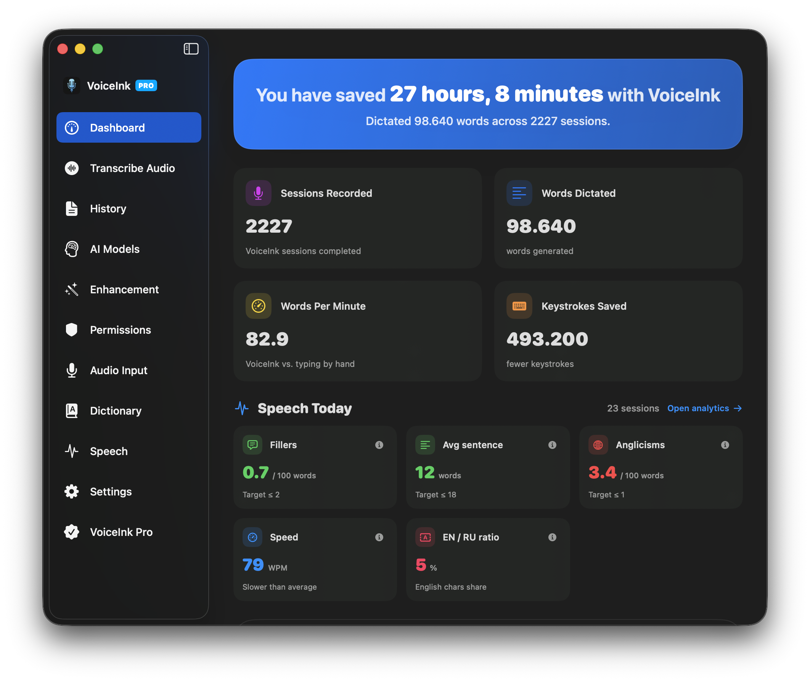

<div align="center">
  
  <h1>VoiceInk</h1>
  <p>Native macOS voice-to-text — transcribe what you say almost instantly, then coach your speaking.</p>

  [](https://www.gnu.org/licenses/gpl-3.0)
  
</div>

---

VoiceInk is a native macOS app for fast, private voice dictation: press a hotkey, speak, and the
transcribed (optionally AI-polished) text is pasted into whatever field has focus. On top of plain
dictation it records per-session speech metrics and gives you a full **speech-coaching dashboard** —
fillers, pace, prosody, and how closely you match a target speaking style.

> **About this version.** This is a heavily modified fork that has diverged a lot from its origin.
> It adds an entire Speech Coaching & Analytics suite, several transcription backends, voice-prosody
> analysis, local-first AI enhancement, and more. Engineers should start with
> [ARCHITECTURE.md](ARCHITECTURE.md); users can skim the features below.

<div align="center">
  
</div>

## Features

### Transcription
- 🎙️ **Multiple Backends**: Local Whisper (whisper.cpp), on-device NVIDIA Parakeet (`parakeet-tdt-0.6b` v2/v3 via FluidAudio), native Apple `SpeechAnalyzer`, plus optional cloud providers (Groq, ElevenLabs, Deepgram, Mistral, Gemini, Soniox, Speechmatics, AssemblyAI, xAI, Cartesia) and custom OpenAI-compatible endpoints.
- ⚡ **Real-Time Streaming**: On-device streaming transcription with a word-agreement stabilization engine, plus streaming cloud providers.
- 📂 **File & Batch Transcription**: Drag-and-drop audio/video files into a transcription queue; re-transcribe or re-enhance any past recording from the player.

### Privacy
- 🔒 **Private by Default, Offline-Capable**: Local backends keep your audio on-device. Cloud transcription and cloud AI enhancement are **optional, opt-in** paths that send data to the third-party provider you choose.
- 🗑️ **Audio Retention Control**: A background sweep deletes recording files older than a configurable grace period (default 14 days) while keeping the transcript and all speech metrics; auto-delete is configurable for audio and transcripts.

### AI Enhancement
- 🧠 **Context Aware**: Enhancement can adapt to your on-screen content and clipboard.
- 🔄 **Smart Modes**: Switch between AI-powered modes for different writing styles — manually, or automatically via per-prompt **trigger words** spoken in your dictation.
- 🔌 **Flexible Providers**: HTTP API providers, local **Ollama**, or a local **CLI agent** (Pi, Claude, Codex, Copilot) for offline-friendly polishing.

### Workflow
- ⌨️ **Global Shortcuts**: Configurable hotkeys for recording and push-to-talk.
- 🚀 **Power Mode**: Per-app / per-URL profiles that auto-apply your settings, each with its own activation shortcut and an optional **auto-send** key (e.g. Return) to submit dictation straight into chat apps.
- 📝 **Personal Dictionary**: Custom words and smart text replacements, with a floating **Quick Add** panel (global shortcut to add entries from any app) and **Vault Sync** that imports vocabulary from an Obsidian markdown table on launch and on demand.
- 🎵 **Media Control**: Auto-pauses playing media while recording and resumes it on stop, with a HID media-key fallback.
- 💾 **Data Portability**: Export / import all settings, export your transcription history, and export diagnostic logs.

### Speech Coaching & Analytics
- 📊 **Speech Dashboard**: A dedicated Speech screen with Today / Week / Month / All periods and Overview / Words / Coach / History tabs, plus a "Speech Today" summary on the main dashboard.
- 🗣️ **Language Analysis**: Per-dictation detection of filler words, anglicisms, repetitions, and self-corrections — measured per 100 words, with EN/RU ratio, WPM, and sentence complexity.
- 🔍 **Personal Filler Detector**: Learns your own verbal tics from your dictation history (frequency + ubiquity), with a "watching" stage and a change feed with sparklines.
- 🎯 **Voice Style Profiles & Match Score**: Seeded presets (Ericksonian Hypnotist, Tactical Negotiator, Calm Leader, Charismatic Speaker) plus custom profiles, scored 0–100 against your speech.
- 🎓 **Style Coach**: "How to reach the style" guidance, a rotating daily training exercise scored live, and on-target streaks.
- 🎚️ **Voice Prosody**: On-device audio analysis of pitch range, pause ratio, and loudness dynamics (Expressiveness / Pauses / Dynamics).
- 🔬 **Dictation Drill-Down**: Per-session detail with color-coded highlighting of fillers / anglicisms / markers, and an AI "how this style would say it" rewrite with a before/after Match Score.
- 📈 **Weekly Vault Report**: One-click export of a weekly speech report (deltas, Match Score breakdown, top words, recommendation) as Markdown with frontmatter to a configurable Obsidian folder.

## Requirements

- macOS 14.4 or later

## Build from Source

This is a source-only fork — build it yourself with the included Makefile:

```bash
git clone https://github.com/morqan/VoiceInk.git
cd VoiceInk

# Build and run for development
make dev

# Or build a self-signed local app (no Apple Developer account needed)
make local
open ~/Downloads/VoiceInk.app
```

See [BUILDING.md](BUILDING.md) for the full guide (prerequisites, the whisper framework, and the
`LOCAL_BUILD` configuration).

## Documentation

- [Architecture](ARCHITECTURE.md) — how the codebase is laid out and the critical dictation path
- [Building from Source](BUILDING.md) — detailed build instructions
- [Contributing](CONTRIBUTING.md) — how this fork is maintained
- [Code of Conduct](CODE_OF_CONDUCT.md)

## License

Licensed under the **GNU General Public License v3.0** — see [LICENSE](LICENSE). As a derivative work
it remains GPL-v3; any redistribution must keep the same license.

## Acknowledgments

### Core Technology
- [whisper.cpp](https://github.com/ggerganov/whisper.cpp) — High-performance inference of OpenAI's Whisper model
- [FluidAudio](https://github.com/FluidInference/FluidAudio) — On-device Parakeet model implementation

### Essential Dependencies
- [Sparkle](https://github.com/sparkle-project/Sparkle) — App updates
- [KeyboardShortcuts](https://github.com/sindresorhus/KeyboardShortcuts) — User-customizable keyboard shortcuts
- [LaunchAtLogin](https://github.com/sindresorhus/LaunchAtLogin) — Launch at login
- [MediaRemoteAdapter](https://github.com/ejbills/mediaremote-adapter) — Media playback control during recording
- [Zip](https://github.com/marmelroy/Zip) — File compression utilities
- [SelectedTextKit](https://github.com/tisfeng/SelectedTextKit) — Reading selected text on macOS
- [Swift Atomics](https://github.com/apple/swift-atomics) — Low-level atomics for thread-safe code

---

<sub>Forked from <a href="https://github.com/Beingpax/VoiceInk">Beingpax/VoiceInk</a> — thanks to the original author for the foundation.</sub>
